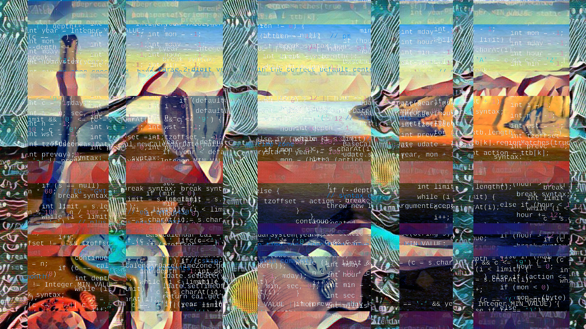

= Working with date and time in Java: Legacy java.util.Date
:author: Alexey Beshenov
:docdatetime: 2023-01-07T00:00-06:00
:source-highlighter: highlightjs
:highlightjs-languages: java
:toc:

I wanted to review how to work with date and time in Java.
There are two things to know: legacy
link:https://docs.oracle.com/en/java/javase/17/docs/api/java.base/java/util/Date.html[`java.util.Date`] /
link:https://docs.oracle.com/en/java/javase/17/docs/api/java.base/java/util/Calendar.html[`java.util.Calendar`]
and modern API in the `java.time` package (introduced in Java 8).
Here we will talk about the legacy part.

Normally our code should not contain `java.util.Date` and `java.util.Calendar`.
However, some legacy APIs still use `java.util.Date` to represent date and time,
and even some widely used libraries are reluctant to move to `java.time`.

== Introducing java.util.Date

`java.util.Date` is a very old class. Some of its methods were deprecated
already in JDK 1.1 (released in 1997).

You can see the source code in Open JDK:
https://github.com/openjdk/jdk/blob/master/src/java.base/share/classes/java/util/Date.java

To play with this class, let's run some code snippets directly in `jshell`.

[source, text]
----
jshell> new Date()
$ ==> Sat Jan 07 16:20:00 CST 2023
----

The default constructor for `Date` returns the current *date and time*.
I'm writing this on January 7 at 4:20 PM.

The name of `java.util.Date` is confusing. What it really represents is
*date-time*. A better name would be `DateTime`.
The confusion is even worse because there is a method `getDate()` which
returns... the day of month!

[source, text]
----
jshell> var date = new Date()
date ==> Sat Jan 07 16:20:00 CST 2023
jshell> date.getDate()
$ ==> 7
----

Here are more confusing methods:

[source, text]
----
jshell> date.getDate()  // a better name would be dayOfMonth
$ ==> 7

jshell> date.getDay()   // a better name would be dayOfWeek
$ ==> 6

jshell> date.getMonth()
$ ==> 0

jshell> date.getYear()
$ ==> 123

> date.getTime()
$ ==> 1673130000469
----

- `getDay()` returns an integer, where 0 means Sunday and 6 means Saturday.
This can be extra confusing for cultures where the week starts on Monday.
A better designed API should return an enum constant like `SATURDAY`
and rename the field to `dayOfWeek`.

- `getMonth()` returns month as an integer, **counting from 0**.
This is obviously a source of many mistakes. Returning an enum constant
like `JANUARY` would be much better.

- `getYear()` returns the year **counting from 1900**.

- `getTime()` is the link:https://en.wikipedia.org/wiki/Unix_time[**UNIX time**]
in milliseconds, i.e. the number of milliseconds that have elapsed since
00:00:00 UTC on 1 January 1970. This is what `Date` actually stores inside.

The default constructor of `Date` uses `System.currentTimeMillis()`.

In particular, `getDate()` will be negative for dates before 1970.

"getTime" is yet another unfortunate naming: "time" is a very general concept,
why should it be the UNIX time in milliseconds? This is more like an internal
representation.

Since `Date` only stores the UNIX time inside, it will overflow at some point.
You may have heard about the
link:https://en.wikipedia.org/wiki/Year_2038_problem[year 2038 problem].
It will happen when UNIX time in seconds will overflow the `int` type,
more precisely 32-bit signed integer. Thankfully `Date` uses `long`,
which is a 64-bit signed integer, and `2^63 - 1` is *much bigger* than `2^31 - 1`
(and we can safely afford storing milliseconds as well).

What is also confusing about `Date` is the output representation
"Sat Jan 07 16:50:05 CST 2023". Here "CST" refers to
link:https://en.wikipedia.org/wiki/Central_Time_Zone[Central Time Zone],
where I am at the moment. There is even a method `getTimezoneOffset()`.
Javadoc says it returns
"the offset, measured in minutes, for the local time zone relative to UTC".

[source, text]
----
jshell> date.getTimezoneOffset()
$ ==> 360
----

That's because I'm 6 hours behind UTC now. But now if we run this in a different
environment, we can get something different:

[source, text]
----
jshell> var date = new Date()
date ==> Sat Jan 07 22:20:00 UTC 2023

jshell> date.getTimezoneOffset()
$ ==> 0
----

In fact, `Date` is not aware of time zone or offset! It always represents
the UTC time. The return of `toString()` and `getTimezoneOffset()` is misleading.

== How to deal with java.util.Date

java.util.Date should not be used in new Java projects. If we receive it
from older APIs, we should convert it to
link:https://docs.oracle.com/en/java/javase/17/docs/api/java.base/java/time/Instant.html[`java.time.Instant`].
For this, Java 8 introduced `toInstant()` method:

[source, text]
----
jshell> date.toInstant()
$ ==> 2023-01-07T22:20:02Z
----

`Instant` stores *time instant*, i.e. a single point on the time-line.
It is more precise than `Date` because `Date` uses milliseconds and `Instant`
uses nanoseconds.

Note that `toString()` for `Instant` follows the
link:https://en.wikipedia.org/wiki/ISO_8601[ISO-8601 format].
It doesn't include time offset, because it always UTC.

Thanks to `toInstant()`, we pass from `java.util.Date` to the modern
link:https://docs.oracle.com/en/java/javase/17/docs/api/java.base/java/time/package-summary.html[`java.time`] API.
I will talk about it in the next note. Here is a small correspondence between
the old and new API.

|=====
| Old API | New API

| `java.util.Date`
| link:https://docs.oracle.com/en/java/javase/17/docs/api/java.base/java/time/Instant.html[`java.time.Instant`], `date.toInstant()`, `Date.from(Instant instant)`

| `java.util.Calendar`
| `calendar.toInstant()`

| `java.util.GregorianCalendar`
| `gregorianCalendar.toZonedDateTime()`, `GregorianCalendar.from(ZonedDateTime zdt)`

| `java.util.TimeZone`
| link:https://docs.oracle.com/en/java/javase/17/docs/api/java.base/java/time/ZoneId.html[`java.time.ZoneId`], `TimeZone getTimeZone(ZoneId zoneId)`, `timeZone.toZoneId()`

| `new Date()`
| `Instant.now()`

| `new Date(123, 0, 7)`
| `LocalDate.of(2023, Month.JANUARY, 7)`

| `date.getMonth()`
| `getMonth()` (returns link:https://docs.oracle.com/en/java/javase/17/docs/api/java.base/java/time/Month.html[`java.time.Month`])

| `new Date(123, 0, 7, 16, 20, 30)`
| `LocalDateTime.of(2023, Month.JANUARY, 7, 16, 20, 30)`

| `date.getDay()` (`int` with 0 = Sunday)
| `getDayOfWeek()` (returns link:https://docs.oracle.com/en/java/javase/17/docs/api/java.base/java/time/DayOfWeek.html[`java.time.DayOfWeek`])

| `date.getYear()` (`int` with 0 = 1900)
| `getYear()` (returns normal year, e.g. `2023`)
|=====

Here are some relevant methods for interfacing between the `java.util` classes
and `java.time` API:

[source, java]
----
public class java.util.Date {
  public static java.util.Date from(java.time.Instant);
  public java.time.Instant toInstant();
}

public abstract class java.util.Calendar {
  public final java.time.Instant toInstant();
}

public class java.util.GregorianCalendar extends java.util.Calendar {
  public static java.util.GregorianCalendar from(java.time.ZonedDateTime);
  public java.time.ZonedDateTime toZonedDateTime();
}

public abstract class java.util.TimeZone {
  public static java.util.TimeZone getTimeZone(java.time.ZoneId);
  public java.time.ZoneId toZoneId();
}
----

If we want to add offset or time zone, we can call `atOffset()` and `atZone()`
on `Instant` or `LocalDateTime`.

[source, text]
----
jshell> date.toInstant().atOffset(ZoneOffset.ofHours(-6))
$ ==> 2023-01-07T16:20:02-06:00

jshell> date.toInstant().atZone(ZoneId.of("America/Mexico_City"))
$ ==> 2023-01-07T16:20:02-06:00[America/Mexico_City]

jshell> LocalDate.of(2023, Month.JANUARY, 7)
            .atStartOfDay()
            .atOffset(ZoneOffset.ofHours(-6))
$ ==> 2023-01-07T00:00-06:00

jshell> LocalDate.of(2023, Month.JANUARY, 7)
            .atStartOfDay()
            .atZone(ZoneId.of("America/Mexico_City"))
$ ==> 2023-01-07T00:00-06:00[America/Mexico_City]
----

The old API also contains an abstract class
link:https://docs.oracle.com/en/java/javase/17/docs/api/java.base/java/util/Calendar.html[`java.util.Calendar`]
and its concrete subclass
link:https://docs.oracle.com/en/java/javase/17/docs/api/java.base/java/util/GregorianCalendar.html[`java.util.GregorianCalendar`].
It was introduced in JDK 1.1 to make calculations with date and time.
It is obsolete in Java 8+.

[source, text]
----
jshell> Calendar.getInstance()
$ ==> java.util.GregorianCalendar[
        time=1673138248965,
        areFieldsSet=true,
        areAllFieldsSet=true,
        lenient=true,
        zone=sun.util.calendar.ZoneInfo[
            id="America/Mexico_City",
            offset=-21600000,
            dstSavings=3600000,
            useDaylight=true,
            transitions=99,
            lastRule=java.util.SimpleTimeZone[
                id=America/Mexico_City,
                offset=-21600000,
                dstSavings=3600000,
                useDaylight=true,
                startYear=0,
                startMode=3,
                startMonth=3,
                startDay=1,
                startDayOfWeek=1,
                startTime=7200000,
                startTimeMode=0,
                endMode=2,
                endMonth=9,
                endDay=-1,
                endDayOfWeek=1,
                endTime=7200000,
                endTimeMode=0
            ]
        ],
        firstDayOfWeek=1,
        minimalDaysInFirstWeek=1,
        ERA=1,
        YEAR=2023,
        MONTH=0,
        WEEK_OF_YEAR=1,
        WEEK_OF_MONTH=1,
        DAY_OF_MONTH=7,
        DAY_OF_YEAR=7,
        DAY_OF_WEEK=7,
        DAY_OF_WEEK_IN_MONTH=1,
        AM_PM=1,
        HOUR=6,
        HOUR_OF_DAY=18,
        MINUTE=37,
        SECOND=28,
        MILLISECOND=965,
        ZONE_OFFSET=-21600000,
        DST_OFFSET=0
    ]
----

== Other languages

Conventions like January being 0 and December being 11,
or Sunday being 0 and Saturday being 6 were not invented by Java.
They can be found in C/C++ code.

JavaScript also has a class
link:https://developer.mozilla.org/en-US/docs/Web/JavaScript/Reference/Global_Objects/Date[`Date`]
which works similarly to `java.util.Date` and suffers from the same problems.
It is supposed to be replaced with the
link:https://tc39.es/proposal-temporal/docs/[Temporal API].

== Mutability issue

`java.util.Date` represents a single value: a point on the time-line. Normally
it should be immutable, but it is not. It has setters that modify the underlying data.

We note that `java.util.Date` implements `equals()` and `hashCode()` in
a reasonable way. But we should be careful, because a `Date` object can mutate
over the time.

Here is what can go wrong.

[source, text]
----
jshell> record Period(Date start, Date end) { }
|  created record Period

jshell> import java.time.*

jshell> var period = new Period(
                         Date.from(Instant.parse("2023-01-07T16:20:00Z")),
                         Date.from(Instant.parse("2023-01-07T17:20:00Z"))
                     )
period ==> Period[start=Sat Jan 07 10:20:00 CST 2023, end=Sat Jan 07 11:20:00 CST 2023]

jshell> period.start().setDate(10)

jshell> period
period ==> Period[start=Tue Jan 10 10:20:00 CST 2023, end=Sat Jan 07 11:20:00 CST 2023]

jshell> var date1 = Date.from(Instant.parse("2023-01-07T16:20:00Z"))
date1 ==> Sat Jan 07 10:20:00 CST 2023

jshell> var date2 = Date.from(Instant.parse("2023-01-07T17:20:00Z"))
date2 ==> Sat Jan 07 11:20:00 CST 2023

jshell> var period = new Period(date1, date2)
period ==> Period[start=Sat Jan 07 10:20:00 CST 2023, end=Sat Jan 07 11:20:00 CST 2023]

jshell> date1.setDate(10)

jshell> period
period ==> Period[start=Tue Jan 10 10:20:00 CST 2023, end=Sat Jan 07 11:20:00 CST 2023]
----

The correct way to deal with the mutability of `Date` is to make
"defensive copies":

- If we receive a `Date` and want to store it (e.g. in the constructor),
then we copy it with something like `this.date = new Date(date.getTime())`.

- Similarly, if our class stores a `Date`, we should not return it directly
in the accessor methods. Instead, we return a copy like `new Date(date.getTime())`.

This is discussed in Bloch's, "Effective Java",
Item 50: Make defensive copies when needed.

== How should immutable values work

In the new `java.time` API, everything is immutable.
E.g. `java.util.Date` allows us to call `date.setDate(10)`, which is an old-school
setter mutating the object. In the new API, we should do the following:

[source, text]
----
jshell> LocalDateTime.ofInstant(
                new Date().toInstant(),
                ZoneId.of("America/Mexico_City")
            )
            .withDayOfMonth(10)
$ ==> 2023-01-10T16:20:00
----

Here `java.time.LocalDateTime` defines methods like
`withDayOfMonth()`, `withDayOfYear()`, `withHour()`, `withMinute()`.
They don't modify the underlying date-time, instead they return a copy.

Similarly, there are methods

- `plusYears()` / `minusYears()`,
- `plusMonths()` / `minusMonths()`,
- `plusWeeks()` / `minusWeeks()`,
- `plusDays()` / `minusDays()`,
- `plusHours()` / `minusHours()`,
- `plusMinutes()` / `minusMinutes()`,
- `plusSeconds()` / `minusSeconds()`,
- `plusNanos()` / `minusNanos()`.

They do not modify the underlying object, instead they return a new instance.

[source, text]
----
jshell> LocalDateTime.now().plusDays(23)
$ ==> 2023-01-30T16:20:00
----

Classes in `java.time` defines getter, e.g. `LocalDateTime` has
`getYear()`,
`getMonth()`,
`getDayOfMonth()`,
`getDayOfWeek()`,
`getDayOfYear()`,
`getHour()`,
`getMinute()`,
`getSecond()`,
`getNano()`.

There are no setters.

== Summary

The legacy API for working with date and time is
link:https://docs.oracle.com/en/java/javase/17/docs/api/java.base/java/util/Date.html[`java.util.Date`].
This class represents roughly the same as
link:https://docs.oracle.com/en/java/javase/17/docs/api/java.base/java/time/Instant.html[`java.time.Instant`].
We should prefer the
link:https://docs.oracle.com/en/java/javase/17/docs/api/java.base/java/time/package-summary.html[`java.time`]
API introduced in Java 8.

Passing from `java.util.Date` to the `java.time` API is a good example of
refactoring old-school Java code with mutable objects to immutable values.

`java.time` has also more consistent naming, e.g. instead of
`date.getDay() = 6` and `date.getDate() = 7` it is better to have
`localDateTime.getDayOfWeek() = SATURDAY` and `localDateTime.getDayOfMonth() = 7`.

== Coming soon...

In the next note we will see more about
link:https://docs.oracle.com/en/java/javase/17/docs/api/java.base/java/time/package-summary.html[`java.time`],
including
link:https://docs.oracle.com/en/java/javase/17/docs/api/java.base/java/time/Instant.html[`Instant`]
link:https://docs.oracle.com/en/java/javase/17/docs/api/java.base/java/time/LocalDate.html[`LocalDate`]
link:https://docs.oracle.com/en/java/javase/17/docs/api/java.base/java/time/LocalTime.html[`LocalTime`]
link:https://docs.oracle.com/en/java/javase/17/docs/api/java.base/java/time/LocalDateTime.html[`LocalDateTime`]
link:https://docs.oracle.com/en/java/javase/17/docs/api/java.base/java/time/OffsetDateTime.html[`OffsetDateTime`]
link:https://docs.oracle.com/en/java/javase/17/docs/api/java.base/java/time/ZonedDateTime.html[`ZonedDateTime`].
Formatting and parsing is of course a common concern, so we will discuss that.
Another interesting topic is
link:https://docs.oracle.com/en/java/javase/17/docs/api/java.base/java/time/Clock.html[`java.time.Clock`]. It allows to control the time
and test some code.

"Time is what we measure with a clock" (a quote attributed to Einstein).
